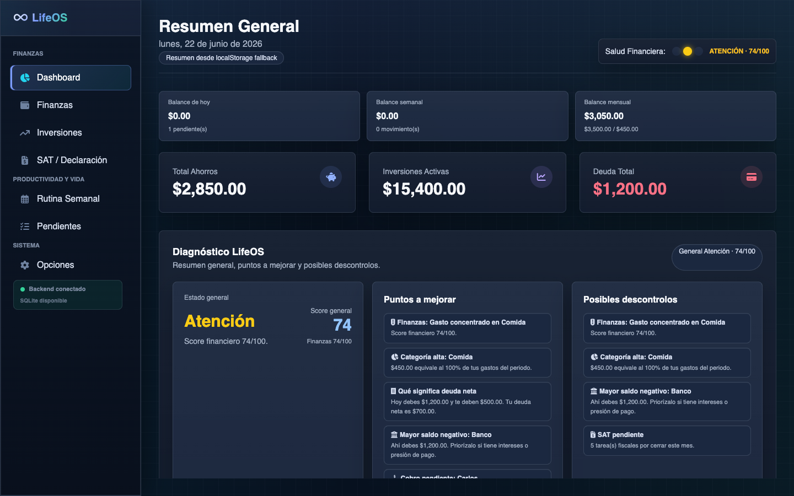
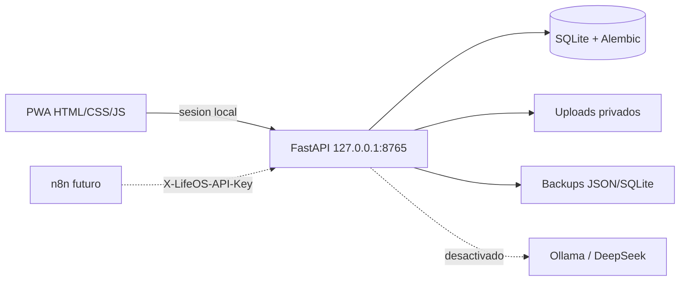

# Life OS Personal

Aplicacion local-first para organizar finanzas, tareas, salud, rutina, documentos fiscales y mantenimiento personal desde una PWA respaldada por FastAPI y SQLite.

> **English summary:** Life OS Personal is a privacy-focused, local-first personal operations platform. It combines a PWA frontend with a FastAPI/SQLite backend, gradual legacy-data migration, automatic backups, reviewed automation inboxes and optional local AI contracts.



## Por que existe

Life OS concentra informacion que normalmente queda dispersa en hojas de calculo, notas y calendarios:

- ingresos, gastos, presupuestos, deudas, suscripciones e inversiones;
- CFDI/XML y resumen fiscal informativo;
- tareas, eventos, rutinas, salud y mantenimiento del coche;
- importacion gradual desde la PWA heredada;
- backups JSON y SQLite sin credenciales;
- contratos seguros para n8n y Ollama, desactivados por defecto.

## Arquitectura



Los datos reales viven fuera del repositorio en:

```text
~/Library/Application Support/LifeOS/
```

Consulta [Arquitectura](docs/ARCHITECTURE.md) para el diseño completo.

## Inicio rapido en macOS

Requisitos: Python 3.12, Node.js y pnpm.

```bash
git clone https://github.com/JLeonardoGG/life-os-personal.git
cd life-os-personal
./scripts/install-local.command
```

El instalador:

1. crea `.venv`;
2. instala FastAPI, SQLAlchemy y Alembic;
3. compila Tailwind y dependencias offline;
4. genera secretos locales;
5. instala un LaunchAgent;
6. abre `http://127.0.0.1:8765`.

Inicio manual:

```bash
./scripts/start-lifeos.command
```

Detener:

```bash
./scripts/stop-lifeos.command
```

## Desarrollo

```bash
python3.12 -m venv .venv
.venv/bin/pip install -e '.[dev]'
pnpm install --ignore-scripts
pnpm run build
.venv/bin/pytest
.venv/bin/ruff check backend tests
python scripts/scan-private-data.py
```

API interactiva:

```text
http://127.0.0.1:8765/api/docs
```

## Migrar la version heredada

En **Opciones > Backend local Life OS V1**:

1. ejecuta **Vista previa**;
2. revisa conteos y exclusiones;
3. ejecuta **Migrar a SQLite**;
4. conserva `localStorage` hasta validar cada modulo.

La boveda heredada de contrasenas no se envia ni se migra. Consulta [Migracion](docs/MIGRATION.md).

Salud, rutinas y coche ya cuentan con lectura SQLite, fallback local, paridad e interfaces de
escritura experimental. Sus flags permanecen apagados hasta validar la migracion personal.

## Automatizaciones

`POST /api/inbox/message` recibe texto, propone una clasificacion y lo deja en `pending_review`. Ningun gasto, tarea o evento se crea hasta confirmar el mensaje.

n8n y Ollama no se activan en V1. Sus contratos estan documentados en:

- [Automatizaciones y n8n](docs/AUTOMATIONS.md)
- [Ollama / DeepSeek](docs/OLLAMA.md)

## Datos demo

```bash
.venv/bin/lifeos-seed-demo --force
```

Genera una base separada en `demo/lifeos-demo.db`. Nunca escribe sobre la base personal.

## Seguridad

- FastAPI escucha solo en `127.0.0.1`.
- La PWA usa cookie HttpOnly `SameSite=Strict`.
- n8n usara `X-LifeOS-API-Key` e `Idempotency-Key`.
- No se guardan contrasenas bancarias/SAT, CVV, NIP ni tokens.
- XML se procesa sin entidades externas.
- `.gitignore` excluye bases, uploads, backups, logs y documentos financieros.
- `scripts/scan-private-data.py` revisa archivos versionados antes de publicar.

Consulta [Privacidad](docs/PRIVACY.md).

## Version publica

Este repositorio es un snapshot limpio para portafolio. Incluye datos demo, pruebas y controles de privacidad, pero no contiene la base personal, documentos fiscales, estados de cuenta, fotografias ni credenciales locales.

## Estado

Life OS V1 esta en migracion gradual. La PWA heredada sigue operativa mientras sus dominios se trasladan a SQLite. Consulta el [Roadmap](docs/ROADMAP.md).

## Licencia

[MIT](LICENSE)
