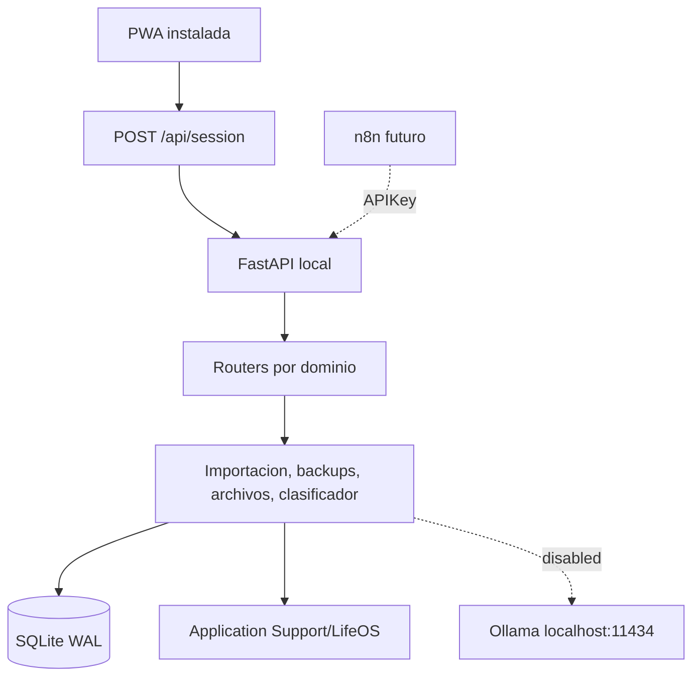

# Arquitectura

## Componentes

## Backend

- `config.py`: configuracion, directorios y secretos generados localmente.
- `database.py`: engine SQLite, WAL y claves foraneas.
- `models.py`: entidades SQLAlchemy.
- `routers/`: contratos REST separados por dominio.
- `services/`: backups, migracion, archivos, CFDI, clasificacion e IA opcional.
- `migrations/`: historial Alembic.

FastAPI sirve tambien la PWA, por lo que no se habilita CORS.

## Frontend

La interfaz heredada permanece funcional. `frontend/js/core/bootstrap.js` agrega:

- sesion local;
- estado del backend;
- vista previa y commit de migracion;
- backup V1.

Las dependencias frontend se compilan/copían a `frontend/assets`, eliminando la dependencia de CDN.

## Persistencia

SQLite usa montos monetarios en centavos enteros. Los registros poseen UUID, timestamps, `legacy_key` para importacion idempotente y `deleted_at` para borrado logico.

Los archivos se almacenan fuera del repositorio y SQLite guarda SHA-256, ruta relativa y metadatos.

## Seguridad

- enlace exclusivo a loopback;
- sesion HttpOnly para la PWA;
- API key para automatizaciones;
- idempotency key para escrituras externas;
- logs sin payload financiero completo;
- secretos en `.env` privado dentro del directorio de datos.
