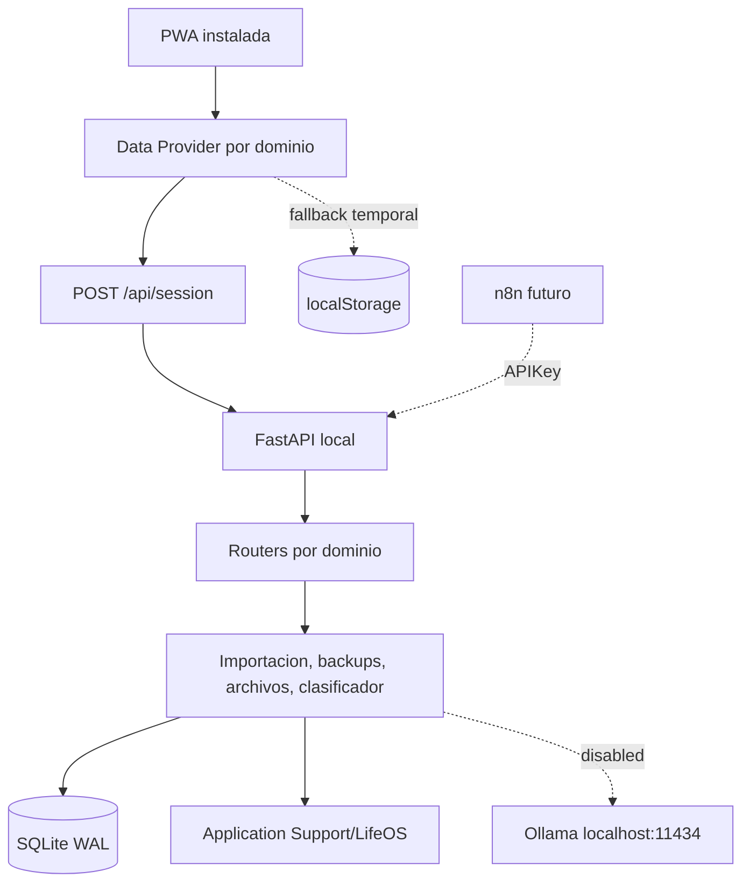

# Arquitectura

## Componentes



## Backend

- `config.py`: configuracion, directorios y secretos generados localmente.
- `database.py`: engine SQLite, WAL y claves foraneas.
- `models.py`: entidades SQLAlchemy.
- `routers/`: contratos REST separados por dominio.
- `services/`: backups, migracion, archivos, CFDI, clasificacion e IA opcional.
- `migrations/`: historial Alembic.

FastAPI sirve tambien la PWA, por lo que no se habilita CORS.

## Frontend

La interfaz heredada permanece funcional. `frontend/js/core/bootstrap.js` agrega:

- sesion local;
- estado del backend;
- vista previa y commit de migracion;
- backup V1.

Las dependencias frontend se compilan/copían a `frontend/assets`, eliminando la dependencia de CDN.

### Fase 2: Frontend API Bridge

La capa temporal de acceso a datos vive en:

- `frontend/assets/js/core/apiClient.js`: solicitudes JSON, timeout y errores claros.
- `frontend/assets/js/core/backendStatus.js`: estado `online`, `offline` o `unknown`.
- `frontend/assets/js/core/dataProvider.js`: API primero y fallback por dominio.
- `frontend/assets/js/core/featureFlags.js`: activacion gradual sin borrar codigo heredado.
- `frontend/assets/js/domains/dashboardBridge.js`: resumen API con calculo local alternativo.

No se mezclan listas API y localStorage. Si SQLite contiene registros, el dominio usa API; si
SQLite esta vacio y existen registros locales, conserva localStorage para evitar pantallas vacias
o duplicados. Las rutas `/api/*` nunca se almacenan en la cache del service worker.

Estado actual:

- resumen: API con fallback;
- tareas: lectura y escritura API con fallback;
- eventos: lectura y escritura API con fallback;
- transacciones, presupuestos, suscripciones y deudas: lectura API; escritura preparada y desactivada;
- inversiones: lectura API; escritura preparada y desactivada;
- salud, rutinas y coche: lectura API con fallback; escrituras experimentales apagadas;
- SAT: localStorage.

Las funciones heredadas que escriben movimientos permanecen marcadas con
`// LEGACY_LOCALSTORAGE_FALLBACK`.

### Fase 3: Finanzas SQLite Write Bridge

La escritura financiera usa un puente independiente por dominio:

- transacciones: CRUD API con idempotencia, historial y borrado logico;
- presupuestos y suscripciones: CRUD API con montos en centavos;
- deudas: entidades, movimientos, fechas limite, pago minimo y archivo logico;
- inversiones: lectura API y CRUD preparado, sin precios externos;
- paginacion: el frontend recorre todas las paginas de 200 registros.

Los flags de lectura estan activos. Los flags de escritura financiera permanecen apagados
por defecto y se guardan solo como preferencia local de desarrollo. Una escritura API fallida
no se repite automaticamente en localStorage.

### Fase 4: Salud y Coche en SQLite

Salud, bienestar, gimnasio, cardio, skincare, rutina semanal y coche usan el mismo patron:

- lectura paginada desde API;
- fallback completo a `localStorage` cuando el backend no esta disponible o SQLite esta vacio;
- altas idempotentes mediante `Idempotency-Key`;
- actualizacion auditada en `automation_logs`;
- borrado logico mediante `deleted_at`;
- comparacion agregada de paridad sin imprimir notas personales.

Contratos principales:

```text
GET|POST /api/health/logs
PUT|DELETE /api/health/logs/{id}
GET /api/health/stats
GET|POST /api/routines
PUT|DELETE /api/routines/{id}
GET|POST /api/car/logs
PUT|DELETE /api/car/logs/{id}
GET|POST /api/car/reminders
PUT|DELETE /api/car/reminders/{id}
GET /api/car/summary
PUT /api/car/profile
```

La PWA construye una vista compatible con el estado heredado sin copiar registros API sobre
`lifeos_data_v2`. Los flags de escritura de los tres dominios permanecen apagados por defecto.

## Persistencia

SQLite usa montos monetarios en centavos enteros. Los registros poseen UUID, timestamps, `legacy_key` para importacion idempotente y `deleted_at` para borrado logico.

Los archivos se almacenan fuera del repositorio y SQLite guarda SHA-256, ruta relativa y metadatos.

## Seguridad

- enlace exclusivo a loopback;
- sesion HttpOnly para la PWA;
- API key para automatizaciones;
- idempotency key para escrituras externas;
- logs sin payload financiero completo;
- secretos en `.env` privado dentro del directorio de datos.
